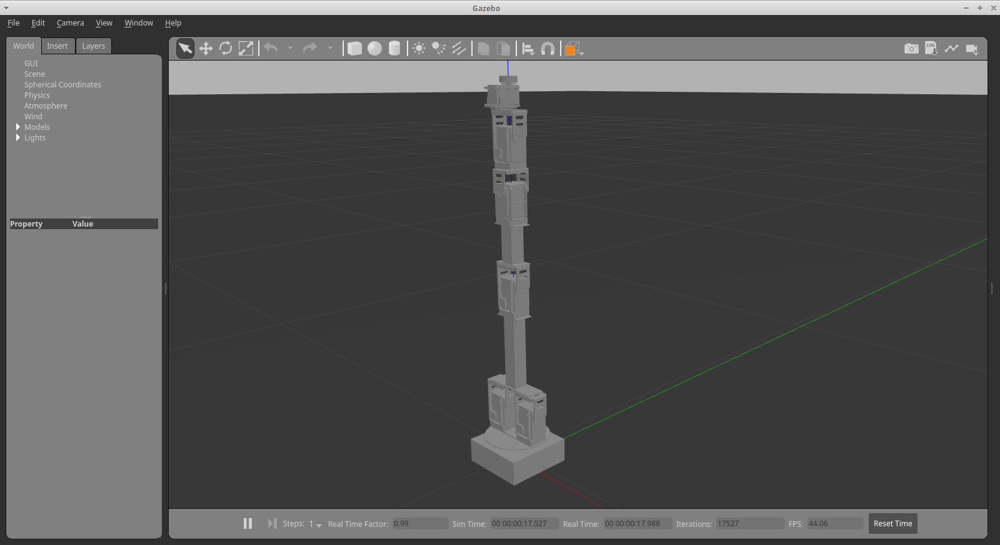

# Project - Crustcrawler simulation

## Setup the simulation

Go the the page [INF3480 - CrustCrawler Setup](https://github.uio.no/INF3480/crustcrawler_simulation/wiki/Setup) and follow the instructions there. NB! Use Ubuntu 18.04 LTS and ROS Melodic, if you have not installer ROS yet.

### Modifying the setup to TEK4030

After successfully setting up the simulation we will check out some changes for the TEK4030 course.

```
$ cd ~/workspace/src/crustcrawler_simulation
$ git checkout tek4030
$ cd ~/workspace/
$ catkin_make
```

Now you can start the simulation with the following command

```
roslaunch crustcrawler_gazebo empty_world.launch
```

Then the robot should look like this



## Setting up package for kinematics and gravity

The [crustcrawler_lib](https://github.uio.no/TEK4030/crustcrawler_lib) package contains the forward kinematics and the gravity vector for the crustcrawler robot. To install the package use the following commands

```
$ cd ~/workspace/src
$ git clone https://github.uio.no/TEK4030/crustcrawler_lib.git
```

Use the classes `Kinematics6DOF` and `DynamicsSimple6DOF` in your controller node to get the forward kinematics and gravity vector. Both classes are initialized with the correct parameters when constructed.

## Assignment

- Create a controller node and implement joint space PD control with gravity compensation
- Simulate the system to find good values for P and D

### Posible extentions

- Implement dynamic reconfigure to be able to change the parameters when the simulation is running
- Extend the controller to be a operational space controller
