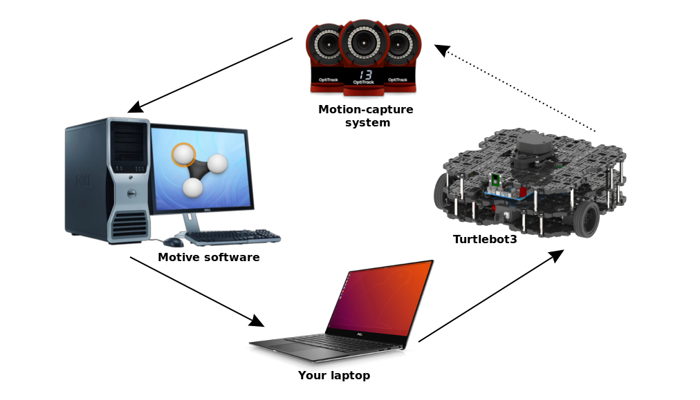
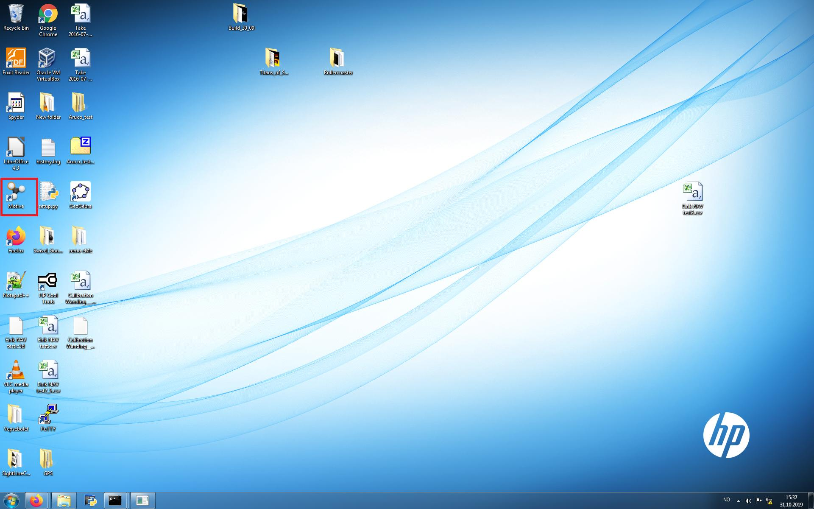
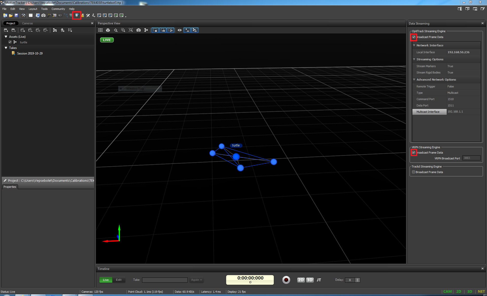
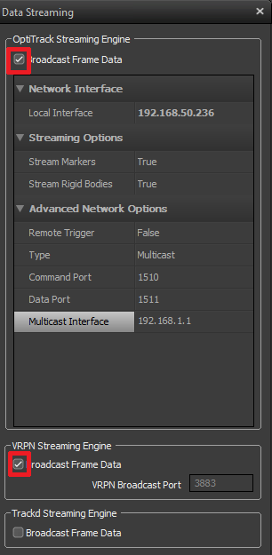

This is a guide for TEK4030 project with the Turtlebot 3 Waffle-pi and
OptiTrack Motion Capture system. The goal of this guide is to configure the
OptiTrack software *Motive*, configure the Turtlebot and configure ROS on your laptop to interface *Motive* and Turtlebot.

The final setup should look something like this:



Prerequisites
=============
- Ubuntu 18.04 / 16.04
- ROS Melodic / Kinetic

Details
=======

### Wifi
SSID: Robotlab
Password: 123Robotlab

### Turtlebots
#### waffle1
* **IP:** 192.168.50.12
* **ssh login:** pi
* **ssh password:** turtlebot
* **default namespace:** /waffle1

#### waffle2
* **IP:** 192.168.50.13 
* **Ssh login:** pi
* **ssh password:** turtlebot
* **defaukt namespace:** /waffle2

#### burger1
* **IP:** 192.168.50.10 
* **ssh login:** pi
* **ssh password:** turtlebot
* **default namespace:** /burger1

#### burger2
* **IP:** 192.168.50.11 
* **ssh login:** pi
* **ssh password:** turtlebot
* **default namespace:** /burger2

Configuration
===============

Motion-capture system
---------------------

### Open existing Motive project
Start by opening the motion-capture software *Motive*, see image below:



When promted, open existing project and select `C:\Users\Vepsebolet\Documents\Calibration\TEK4030\turtlebot3.ttp`. This should open a project that is already calibrated and where a rigid-body of the turtlebot already is configured. 

The turtlebot rigid-body should now appear in *Motive* if the turtlebot is
visible for the motion-capture cameras.



### Begin streaming data 
Start off by making sure the motion-capture workstation is connected to the Robotlab
network via the ethernet cable marked "turtlebot".
Open the *Streaming pane* and make sure the information corresponds to the
screenshot below.



Ticking the boxes will start real-time streaming of the pose of the configured
rigid-bodies over vrpn (Virtual Reality Private Network) which will be
interfaced with ROS later.


### Reconfiguration
#### Recalibration
In the event that a system reconfiguration is necessary, see
https://v21.wiki.optitrack.com/index.php?title=Calibration for guidance. The
Following steps need to be completed: *Masking*, *Wanding*, *Calibration
Results*, *Ground Plane and Origin*.

#### Recreate rigid-body
If a new rigid-body needs to be created, see
https://v21.wiki.optitrack.com/index.php?title=Rigid_Body_Tracking#Creating_Rigid_Body
for guidance.

Turtlebot3
----------
### Edit ROS_MASTER and ROS_HOSTNAME
The turtlebot needs to know the ip address of the pc running the rosmaster.
This is done by editing two variables in .bashrc of the turtlebot via ssh
(Username: pi, password: turtlebot)

```bash
ssh pi@192.168.50.12     
```
If problems with ssh, double check the ip address of the turtlebot with a
monitor and keyboard. 

Open `~/.bashrc` in vim or nano and edit the two last lines containing
`ROS_MASTER_URI` and `ROS_HOSTNAME` and edit so that the look like the
following:

```bash
ROS_MASTER_URI = http://LAPTOP_IP:11311
ROS_HOSTNAME = TURTLEBOT_IP
```
Substitute *LAPTOP_IP* with the ip address of your laptop and *TURTLEBOT_IP*
with the ip address of the turtlebot, presumably `192.168.50.12`. Remember to save and then `source ~/.bashrc`


Laptop
------
### EDIT ROS_MASTER and ROS_HOSTNAME
Similar to the turtlebot, `ROS_MASTER_URI` and `ROS_HOSTNAME` need to be
defined on the remote pc. Open your terminal config file, probably `~/.bashrc`
and append two lines containing the following information:

```bash
ROS_MASTER_URI = http://LAPTOP_IP:11311
ROS_HOSTNAME = LAPTOP_IP
```

Substitute *LAPTOP_IP* with the ip address of your laptop. Remember to save and
source the file.
### Install turtlebot3 ros packages 
Several turtlebot3 packages are needed to interface the turtlebot3. If you are
using ROS kinetic, substitute all *melodic* keywords with *kinetic*.

```bash
sudo apt-get install ros-melodic-joy ros-melodic-teleop-twist-joy
ros-melodic-teleop-twist-keyboard ros-melodic-laser-proc
ros-melodic-rgbd-launch ros-melodic-depthimage-to-laserscan
ros-melodic-rosserial-arduino ros-melodic-rosserial-python
ros-melodic-rosserial-server ros-melodic-rosserial-client
ros-melodic-rosserial-msgs ros-melodic-amcl ros-melodic-map-server
ros-melodic-move-base ros-melodic-urdf ros-melodic-xacro
ros-melodic-compressed-image-transport ros-melodic-rqt-image-view
ros-melodic-gmapping ros-melodic-navigation ros-melodic-interactive-markers
```

```bash
cd ~/catkin_ws/src
git clone https://github.com/ROBOTIS-GIT/turtlebot3_msgs.git
git clone https://github.com/ROBOTIS-GIT/turtlebot3.git
cd ~/catkin_ws
catkin_make
```

### Install vrpn_client_ros
The vprn_client_ros is the ROS node responsible for interfacing the vprn
protocol provided by *Motive*.

```bash
sudo apt-get install ros-melodic-vrpn
cd ~/catkin_ws/src

# The kinetiv-devel branch works for both ROS kinetic and melodic
git clone --branch kinetic-devel https://github.com/ros-drivers/vrpn_client_ros.git
cd ~/catkin_Ws
catkin_make
```

Test setup
==========
1. Make sure that *Motive*, on the motion-capture workstation, is streaming
data over vrpn, as described previously.

2. Start up a roscore
```bash
roscore
```

3. Start the vrpn_client_ros node, substitute `LAPTOP_IP` with the ip of your
   laptop  
```bash
roslaunch vrpn_client_ros sample.launch server:=LAPTOP_IP
```


4. Ssh into the turtlebot and start up turtlebot ros node
```bash
#IP depends on which turtlebot you are using
ssh pi@192.168.50.12     
roslaunch turtlebot3_bringup turtlebot3_robot.launch
```

5. Start up teleop ros node to control turtlebot with the keyboard
```bash
# If you are using a burger, replace 'waffle_pi' with 'burger'
export TURTLEBOT3_MODEL=waffle_pi   
roslaunch turtlebot3_teleop turtlebot3_teleop_key.launch
```

The pose data from *Motive* should now appear at the ros topic
`/vrpn_client_node/turtle/pose` and should publish `geometry_mgs/PoseStamped`
messages:
```bash
#Replace 'waffle1' with the name of turtlebot you're using.
rostopic echo /vrpn_client_node/waffle1/pose    
```

Start the project
=================
A sample ROS node is provided in this repository and can be used as a starting
point. It subscribes to the `/vrpn_client_node/waffle1/pose` topic and publishes
a `geometry_msgs/Twist` message at the `/waffle1/cmd_vel` topic. 

Clone the repository into your catkin workspace and build it to get started:
```bash
cd ~/catkin_ws/src
git clone https://github.uio.no/TEK4030/tek4030_turtlebot3.git
cd ~/catkin_ws
catkin_make
```

If the build passes, it should be ready to run, provided that you already are
running a roscore, vrpn_client_ros node, and the turtlebot3_robot node in the
turtlebot:
```bash
rosrun tek4030_turtlebot3 sample_node
```

If you are using a different turtlebot than 'waffle1', substitute 'waffle1' with the correct 
namespace of the robot, then rebuild the sample node.

